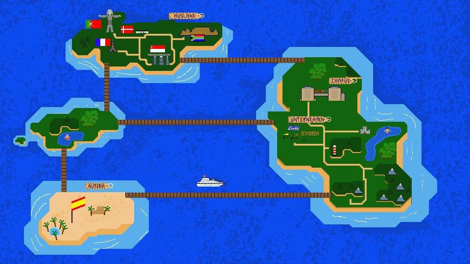
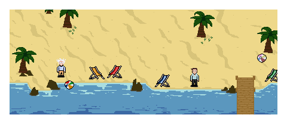
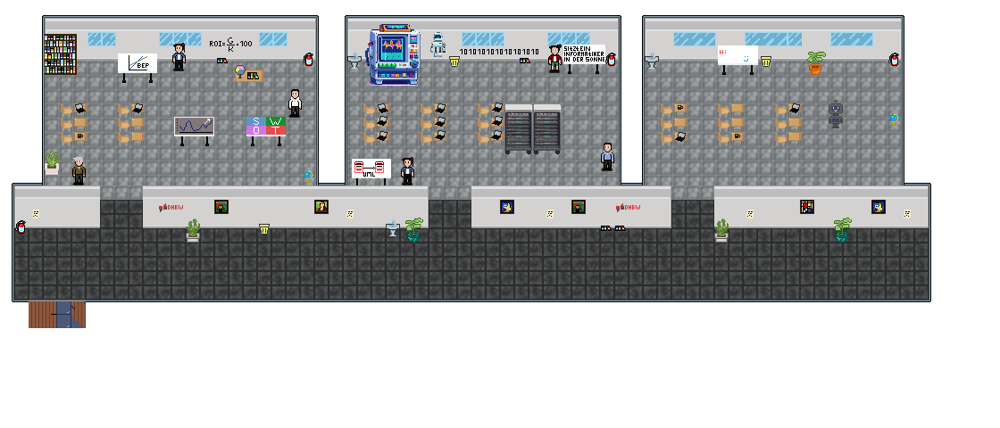
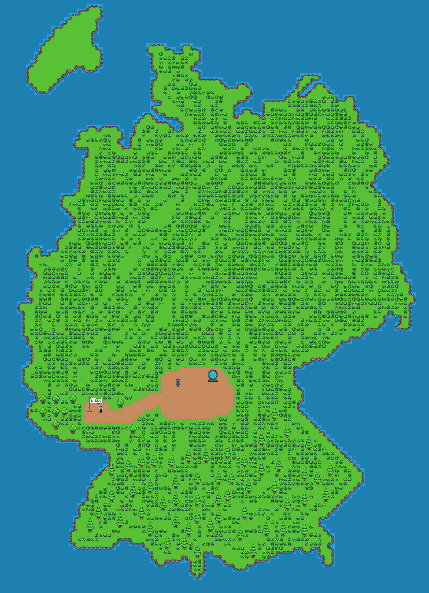
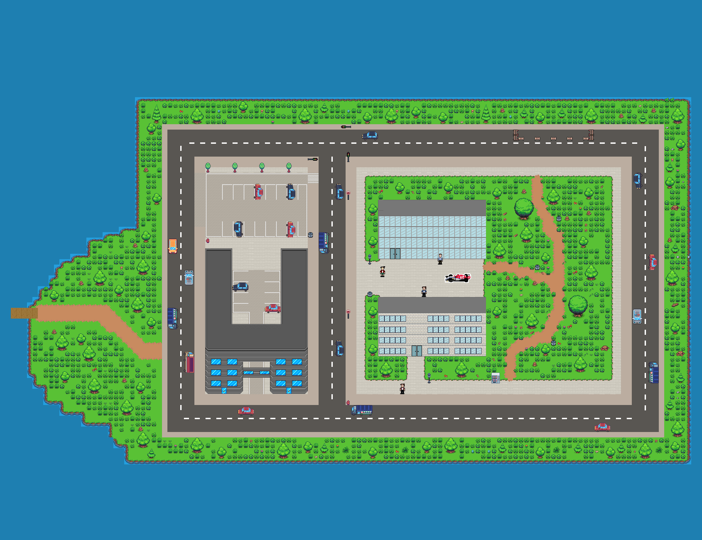

# 🎮 Imbit Pixels - A 2D Adventure Game

[](https://pixels.imbit-n3xt.com)
[](LICENSE)
[](https://dev.pixels.imbit-n3xt.com)
[](https://github.com/replit/kaboom)
[](https://docs.brillianideas.com/projects/imbit-n3xt/pixels)
[](https://github.com/imbit-mannheim/pixels/graphs/contributors)
[](https://github.com/imbit-mannheim/pixels/graphs/contributors)

<div align="center">
  
  
  *Explore, Learn, and Have Fun in the IMBIT Universe!* 🚀
  
  
  
  *Experience the IMBIT journey through interactive gameplay!* 🎮
</div>

## 🎯 Project Goals

- 📚 Provide an engaging learning experience about IMBIT program
- 🌍 Create an immersive virtual campus environment
- 🎮 Make education fun through gamification
- 🤝 Foster community through interactive features
- 📊 Track learning progress through scoring system

## 📚 Official Documentation

For comprehensive documentation about the project, including development guidelines, file structure, and best practices, please visit the official documentation at:
[BrillianDOCS - IMBIT-PIXELS](https://docs.brillianideas.com/projects/imbit-n3xt/pixels)

The documentation covers:
- Development guidelines and branching strategy
- File structure and purpose
- Kaplay framework compliance
- Feature development workflow
- Deployment procedures

## ✨ Features

<div align="center">
  <table>
    <tr>
      <td align="center">
        
        <br/>
        🎭 Character Selection
      </td>
      <td align="center">
        
        <br/>
        🐕 Pet Companion
      </td>
      <td align="center">
        
        <br/>
        🌍 World Exploration
      </td>
    </tr>
  </table>
</div>

- 🎭 **Character Selection**: Choose between male and female characters
- 🐕 **Pet Companion**: Adopt and name your own dog companion
- 🌍 **World Exploration**: Navigate through different maps with unique environments
- 💬 **Dialogue System**: Engage in conversations with NPCs
- 🎯 **Quest System**: Complete various quests and tasks
- 🔊 **Customizable Settings**: Adjust sound effects volume and other preferences
- 🗺️ **World Map**: Access a world map to navigate between different locations
- 🏁 **Spawn Point Selection**: Choose your starting location
- ❓ **Quiz System**: Answer questions to earn points and learn about various topics
- 📥 **Downloadable Content**: Access additional learning materials through in-game downloads

## 🏛️ Game Locations

<div align="center">
  <table>
    <tr>
      <td align="center">
        
        <br/>
        🌍 Almeria
      </td>
      <td align="center">
        
        <br/>
        🍽️ Mensa
      </td>
      <td align="center">
        
        <br/>
        📚 Classroom
      </td>
    </tr>
    <tr>
      <td align="center">
        
        <br/>
        🏢 Company Exhibition
      </td>
      <td align="center">
        
        <br/>
        🏠 Campus
      </td>
    </tr>
  </table>
</div>

The game features several key locations, each with unique content and interactions:

| Location | Description | Icon |
|----------|-------------|------|
| **Almeria** | Partner university location, learn about study abroad opportunities | 🌍 |
| **Mensa** | DHBW Mannheim cafeteria, interact with students and view the menu | 🍽️ |
| **Classroom** | DHBW classroom, gather information about study modules | 📚 |
| **Company Exhibition** | Partner company showcase, learn about industry collaborations | 🏢 |
| **Start Room** | Initial game area with tutorial content | 🏠 |

## 🎮 Controls

| Action | Controls |
|--------|----------|
| **Movement** | WASD, Arrow Keys, or Mouse Click |
| **Dialogue** | Automatically opens when near NPCs |
| **Close Dialogue** | ESC or Close Button |
| **Quiz Answers** | Use the "Answer" buttons |
| **World Map** | Hold M or click the button in bottom right |
| **Teleport** | Use the World Map to travel between locations |

## 🛠️ Technical Details

- 🎮 Built with [Kaplay](https://github.com/replit/kaboom) game engine
- ⚡ Uses Vite for development and building
- 💬 Implements a custom dialogue system
- 🎨 Features sprite-based animations for characters and NPCs
- 📝 Includes a comprehensive quest and interaction system
- 🗺️ Maps are constructed using [Tiled](https://www.mapeditor.org/) map editor
  - Map files and resources can be found at: [IMBIT-Pixels_Public/imbitPixelsTiled](https://git.tobias-dhbw.com/IMBIT-Pixels_Public/imbitPixelsTiled)

## 🚀 Development

### 📋 Prerequisites

- Node.js (latest LTS version recommended)
- npm or yarn
- Tiled Map Editor (for map development)

### ⚙️ Installation

1. Clone the repository
2. Install dependencies:
   ```bash
   npm install
   ```

### 🎮 Running the Game

- Development mode:
  ```bash
  npm run dev
  ```
- Build for production:
  ```bash
  npm run build
  ```
- Create a distributable zip:
  ```bash
  npm run zip
  ```

## 📁 Project Structure

```
📦 imbit-pixels
├── 📂 src
│   ├── 📄 main.js
│   ├── 📄 constants.js
│   ├── 📄 utils.js
│   └── 📄 kaboomCtx.js
├── 📂 public
│   ├── 📂 fonts
│   ├── 📂 images
│   ├── 📂 maps
│   ├── 📂 sounds
│   ├── 📂 sprites
│   └── 📂 downloads
├── 📄 index.html
└── 📄 main.css
```

## 🔄 Feature Development Workflow

1. Create a new branch following the naming convention:
   ```
   feature_Group&groupnumber_featurename
   ```
   Example: `feature_group3_minigame`

2. Develop and test your feature in the feature branch

3. Once the feature is complete:
   - Merge the feature branch into the development branch
   - The development branch is automatically deployed to: [https://dev.pixels.imbit-n3xt.com](https://dev.pixels.imbit-n3xt.com)
   - Perform thorough testing in the development environment

4. After successful testing:
   - Merge the development branch into the main branch
   - The main branch represents the production version of the game

## 🛠️ Troubleshooting

### 🔍 Common Issues

1. **Game not loading**
   - Clear browser cache
   - Ensure all dependencies are installed
   - Check console for errors

2. **Map loading issues**
   - Verify Tiled map files are in the correct location
   - Check map file permissions
   - Ensure map assets are properly linked

3. **Sound issues**
   - Check browser sound settings
   - Verify sound files are in the correct format
   - Ensure sound volume is not muted in game settings

## 🤝 Contributing

Contributions are welcome! Please follow the feature development workflow outlined above and submit a Pull Request.

## 📜 License

This project is licensed under the MIT License - see the LICENSE file for details.

## 🌟 Welcome to IMBIT-PIXELS

This repository serves as a foundation for our small learning game.
You can access our website in the browser at: [https://pixels.imbit-n3xt.com](https://pixels.imbit-n3xt.com)
Within the programming process you can view changes from the dev branch in your browser at: [https://dev.pixels.imbit-n3xt.com](https://dev.pixels.imbit-n3xt.com)

---

<div align="center">
  <sub>Built with ❤️ by the IMBIT Team</sub>
  <br/>
  
</div>

# Naming conventions
For adding new features you should create a new branch. The branch should follow the naming convention: feature_group&groupnumber_featurename 
example: feature_group4_newhaircolour

## Available Scripts

In the project directory, you can run:

### `npm run dev`

Runs the app in the development mode.\
Open [http://localhost:5173](http://localhost:5173) to view it in your browser. The page will reload when you make changes.

### `npm run build`

Builds the app for production to the `dist` folder.

## Pre-Requisites

- npm (package manager)

## Folder Structure

- src: Contains all JavaScript files
- public: Contains all resources
  - fonts: Contains the font used
  - images: Contains all static images used e.g. as favicon
  - maps: Contains the image and data files of all maps
  - sounds: Contains all sound files
  - sprites: Contains all images, split for animations
  - downloads: Contains all downloadable content like PowerPoint files

## Running the App Locally

1. Navigate into the project directory and switch to the game folder.
2. Run `npm run dev` in the terminal.
3. Access the app at [http://localhost:5173](http://localhost:5173).

